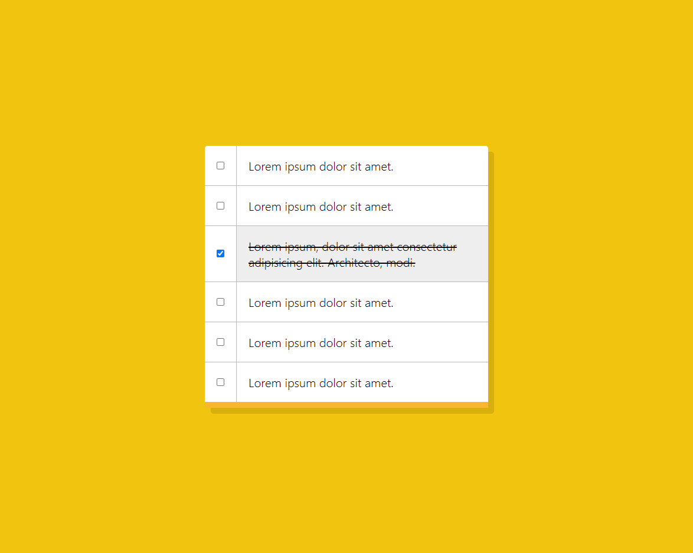

# ⛵나중에 참고할 코드를 저장하는 잡다한 JS 코드 레포🏭

# [💻DEMO all in one](https://caesiumy.github.io/javascript-with-etc/)

## 1. Shift 키로 여러 인풋 컨트롤 하기

- [DEMO](https://caesiumy.github.io/javascript-with-etc/shift_multi_check/index.html)
- [CODE](./shift_multi_check/)

### 📷스크린샷

    </img>

